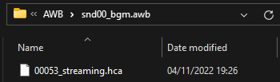
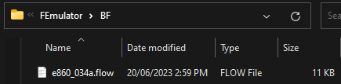
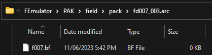
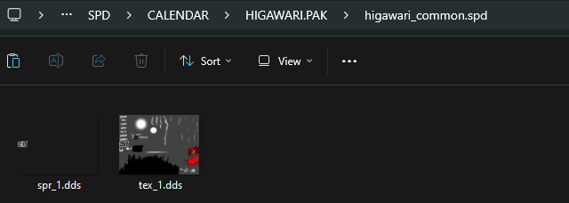

# Usage

## Prerequisites

### Create a Reloaded Mod

Follow the guidance in the [Reloaded wiki](https://reloaded-project.github.io/Reloaded-II/CreatingMods/) to create a new Reloaded mod.  

### Download Mod

!!! note

    This image needs updated.

If you don't have it already, download the `Persona 5 Royal Essentials` Mod.  


### Set Dependency on P5R Essentials

In the `Edit Mod` menu (right click your mod in mods list) we're going to add `Persona 5 Royal Essentials` as a dependency.  


Adding a 'dependency' to your mod will make it such that P5R Essentials will always be loaded when your mod is loaded. This is a necessary step. 

## Replacing files in CPKs

!!! info

    Files inside CPKs can be replaced by creating a folder called `P5REssentials/CPK` in your mod, and adding folders corresponding to the names of the CPKs inside those folders.

### Opening the Mod Folder


Go to the folder where your mod is stored, this can be done by simply clicking the `Open Folder` button.  

### Add Some Files

Make a folder called `P5REssentials`, and inside that a folder called `CPK`.   
Inside that folder, make a folder [or multiple!] where you will store your mod files (you can call it anything you want!).  


I used `EN.CPK` for clarity to match the game's structure.  


We will replace these two files to enable different button prompts 😇.

-----

The contents of our mod folder would now look as follows.

```
// Mod Contents
ModConfig.json
Preview.png
P5REssentials
└─CPK
  └─EN.CPK
    └─BUTTON
      ├─BUTTON_XBOX.PAK
      └─BUTTONXBOXTEXINFO.DAT
```


The connectors `└─` represent folders.

## Replacing Music

!!! info

    Essentials can be used to replace audio inside AWB & ACB pairs.  

[Uses FileRedirectionFramework under the hood, follow instructions here for more information.](https://sewer56.dev/FileEmulationFramework/emulators/awb.html)  
Don't add dependency on AWB emulator (it's not necessary), but do follow rest of guide.
    
### Example

As per usage guide above.  
This works the same as it does in Persona 4 Golden 64-bit/2023 version.



Replaces 53rd audio track (`Signs of Love`).  

!!! warning

    Encryption keys/scheme on the ADX/hca audio must match original file.  
    [Can someone please link Amicitia or other relevant wiki here??]  

## Replacing Files In Archives

!!! info

    Essentials can be used to replace individual files in archives such as PAK, BIN, PAC, and ARC  

[Uses FileRedirectionFramework under the hood, follow instructions here for more information.](https://sewer56.dev/FileEmulationFramework/emulators/pak.html)  
Don't add dependency on PAK emulator (it's not necessary), but do follow rest of guide.
    
### Example

As per usage guide above.  


Replaces `battle/MSG.TBL` in `init_free.bin`.  

## Editing BF Files

!!! info

    Essentials can be used to edit the procedures and messages in BF files such that multiple mods can edit the same file.

[Uses FileRedirectionFramework under the hood, follow instructions here for more information.](https://sewer56.dev/FileEmulationFramework/emulators/bf.html)  
Don't add dependency on BF emulator (it's not necessary), but do follow rest of guide.

In addition to the `.flow` and/or `.msg` files you include in `FEmulator\BF` per the above guide you will also need to add dummy bf files where they would normally go in `FEmulator\PAK` or `P5REssentials\CPK`.

### Example - Loose BF

!!! info

    To create a dummy bf file you can create a new empty text file and just rename it, changing the file extension.

To edit the loose `e860_034a.bf` file in `event_data\script` you would first add a dummy bf file in `P5REssentials\CPK\data_e.cpk\event_data\script`


Then you would put your `.flow` or `.msg` file with the same name in `FEmulator\BF`



### Example - BF In Archive
To edit `f007.bf` in the archive `field\pack\fd007_003.arc` you would first add a dummy bf file in `FEmulator\PAK\field\pack\fd007_003.arc` (as per [the information above](#replacing-files-in-archives))



Then you would put your `.flow` or `.msg` file with the same name in `FEmulator\BF`


## Editing TBL Files
Any TBL files in P3P, P4G and P5R (such as `SKILL.TBL` and `UNIT.TBL`) will automatically be merged if multiple mods edit them. This includes `itemtbl.bin` in P4G and P3P.

### Embedded BF in AICALC.TBL
In P3P and P4G `AICALC.TBL` contains two embedded bf files, `friend.bf` and `enemy.bf`. 
To edit these place a dummy bf with the same name in `FEmulator\PAK\init_free.bin\battle` and then hook anything you want to the same way you would any other bf file.

### Embedded BMD in MSG.TBL
In P3P and P4G `MSG.TBL` contains an embedded bmd file. To edit this place your edited version in `FEmulator\PAK\init_free.bin\battle\msgtbl.bmd`.

!!! info

    When BMD emulator releases you will be able to use it to edit only individual messages in this (and other) bmds, for now though you will have to replace the entire file.

## Editing SPD Files

!!! info

    Essentials can be used to edit textures and sprites in SPD files such that multiple mods can edit sprites in the same texture.

[Uses FileRedirectionFramework under the hood, follow instructions here for more information.](https://sewer56.dev/FileEmulationFramework/emulators/spd.html)  
Don't add dependency on SPD emulator (it's not necessary), but do follow rest of guide.

In addition to the sprite entry files `(.spdspr/.sprt)` and/or textures `(.dds/.tmx)` files you include in `FEmulator\SPD` per the above guide you may need to add dummy spd files where they would normally go in `FEmulator\PAK` (only if the spd you're editing is located in an archive).

### Example - Loose SPD

To edit the loose `CHAT.SPD` file in `FONT\CHAT` you would first create a directory mimicking the path of the spd in `FEmulator\SPD`, including the spds filename.


Then you would put your sprite entry and/or texture files in `FEmulator\SPD\FONT\CHAT\CHAT.SPD\`


### Example - SPD in archive

!!! info

    To create a dummy spd file you can create a new empty text file and just rename it, changing the file extension.

To edit `higawari_common.spd` in the archive `CALENDAR\HIGAWARI.PAK` you would first add a dummy spd file in `FEmulator\PAK\CALENDAR\HIGAWARI.PAK` (as per [the information above](#replacing-files-in-archives))


Then follow the steps for loose spds.



## Releasing/Uploading your Mods

Please refer to the [Reloaded wiki](https://reloaded-project.github.io/Reloaded-II/EnablingUpdateSupport/), and follow the guidance.  

You should both Enable Update Support AND Publish according to the guidelines.  

It is recommended to enable update support even if you don't plan to ship updates as [doing so will allow your mod to be used in Mod Packs.](https://reloaded-project.github.io/Reloaded-II/CreatingModPacks/)
